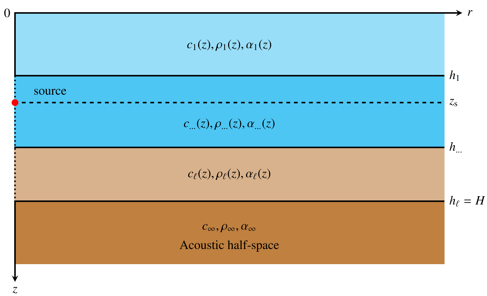
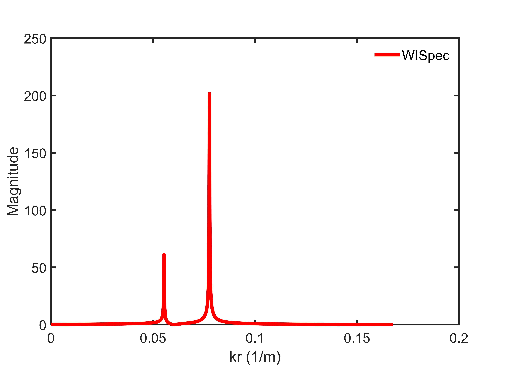
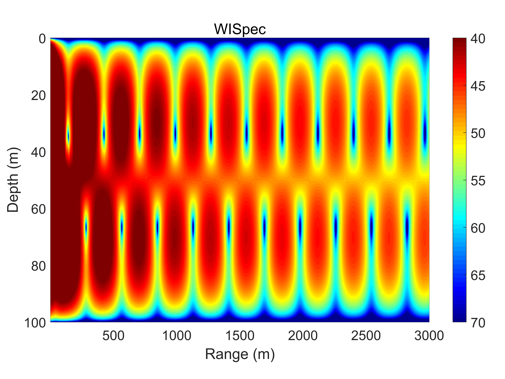

**`WISpec_readme`, May. 7, 2022, Houwang Tu, National University of Defense Technology**

The program `WISpec.m` computes the acoustic field in arbitrary horizontally 
stratified media (as shown in Fig.1) using the Chebyshev-Tau spectral method.
The method is described in the article (H. Tu, Y. Wang, W. Liu et al., A 
Wavenumber Integration Model of Underwater Acoustic Propagation in Arbitrary 
Horizontally Stratified Media Based on Spectral Method, 
https://doi.org/10.1016/j.jsv.2020.115784).

The '`ReadEnvParameter`' function is used to read "`input.txt`" file. 
User can make changes to "`input.txt`" for the desired simulation. 
The "`input.txt`" file contains the parameters defining the modal
calculation. See the following example:

```
Example1                          ! casename
P                                 ! Src, type of sound source
1                                 ! Layers of media
20                                ! Nl (truncation order of layers, Layers rows)
2                                 ! kmax (maximum integral interval)
20.0                              ! freq (frequency of source)
36.0                              ! zs (depth of source)
0.25                              ! dz (discrete length in depth direction)
3000.0                            ! rmax (receiver ranges(m))
1                                 ! dr (discrete length in horizontal direction)
40                                ! tlmin (minimum value of TL in colorbar)
70                                ! tlmax (maximum value of TL in colorbar)
100.0                             ! h (bathmetries of ocean)
2                                 ! n (profiles' points in water column)
    0.0 1500.0  1.0   0.0         ! dep c rho alpha
  100.0 1500.0  1.0   0.0
A                                 ! Lowerboundary (rigid/free/halfspace lower boundary condition)
  100.0 2000.0  2.0   2.0         ! sound speed, density and attenuation of semi-infinite space

```

The "`input.txt`" file include:

*  `casename` is the name of current example;

*  `Src' is the type of sound source, P denotes point source, L denotes line source;

* `Layers` is the number of the layers of media; 

* `Nl` is the number to truncated order of medium; Generally speaking, the
  more complicated the shape of the sound speed profile, the more `Nl`s
  are needed to accurately fit.

* `kmax`, the integral interval is [0, kmax]. 

* `freq` (frequency of sound source, Hz), 

* `zs` (the depth of source, m), 

* `dz` (discrete step size in depth direction, m),

* `rmax` (the maximum range of horizontal direction, m), 

* `dr` (horizontal discrete step, m),

* `tlmin` and `tlmax` are the minmum and maximum value transmission loss,
  respectively, which used to determine the color range of the output
  transmission loss graph, `tlmin` must less than `tlmax`.

* `h` are the bathmetries of ocean of ocean, unit: m. 

* `n`s are the amount of environmental profile data in medium columns.

There is a table of environmental parameter: the units are depth(m), speed(m/s),
  density(g/cm$^3$) and attenuation (dB/wavelength), with `nw`
  points in each layer. It is necessary that `depw(n)=depb(1)` where the
  density usually has a discontinuity. The first entry `dep(1)=0` is the
  free surface. The last entry `dep(n)=H` determines the total thickness
  of the waveguide. 

 
*  `Lowerboundary` (User used to specify whether the seabottom
  boundary condition is perfectly free 'V', perfectly rigid 'R' or semi-infinite space 'A'), 
  The last line is the parameters for the semi-infinite space. 

  
  
  Figure 1. Schematic of arbitrary horizontally stratified marine environment.
  
  The plots resulting from the above dialog are as
  follows:



Figure 2. Wavenumber spectrum of the waveguide.



Figure 3. A colorful plot of transmission loss, range versus depth.
